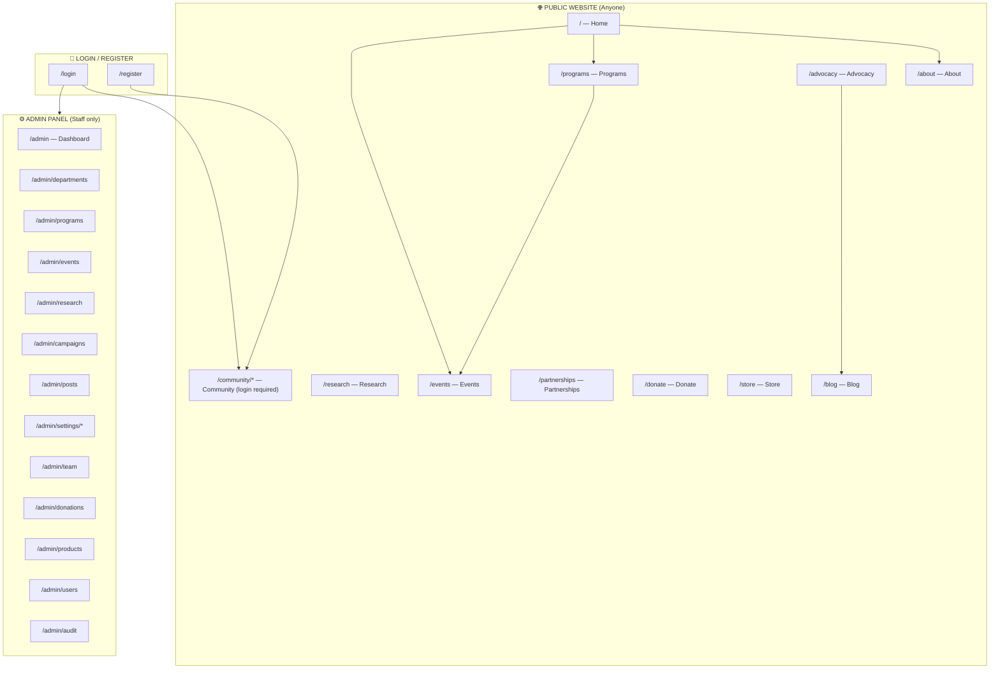
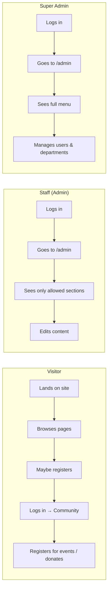
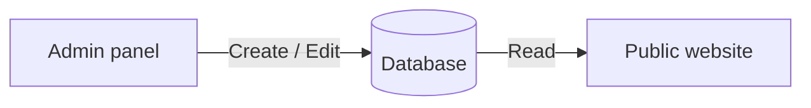
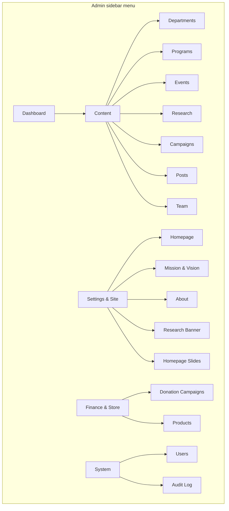
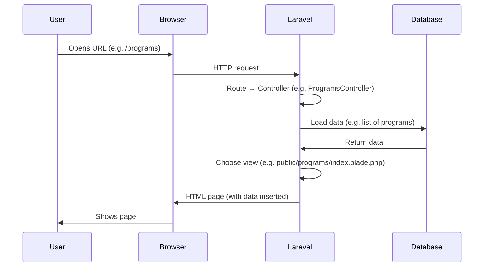
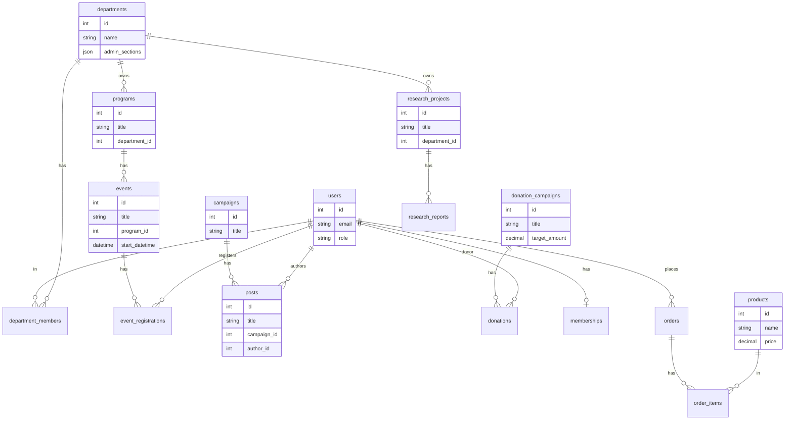

# Animal IQ — Project Documentation

A **Laravel** web application for **Animal IQ**: a wildlife and environmental education organization. The site helps the organization **educate** the public, **engage** youth and community, **showcase impact**, **support programs** (events, research, advocacy), and **enable sustainability** (donations, partnerships, merchandise).

This document describes the project in detail so that **anyone**—including non-technical staff—can understand how the website is structured, what each part does, and how to get it running.

---

## Table of Contents

1. [What Is Animal IQ (the website)?](#1-what-is-animal-iq-the-website)
2. [High-Level Structure (in plain English)](#2-high-level-structure-in-plain-english)
3. [Visual Diagrams](#3-visual-diagrams)
4. [The Public Website (what visitors see)](#4-the-public-website-what-visitors-see)
5. [The Admin Panel (what staff use to manage content)](#5-the-admin-panel-what-staff-use-to-manage-content)
6. [User Roles and Permissions](#6-user-roles-and-permissions)
7. [Database Overview](#7-database-overview)
8. [Technical Stack](#8-technical-stack)
9. [Project Folder Structure](#9-project-folder-structure)
10. [How to Set Up and Run the Project](#10-how-to-set-up-and-run-the-project)
11. [Glossary](#11-glossary)

---

## 1. What Is Animal IQ (the website)?

**Animal IQ** is the organization’s main website. It has two big parts:

| Part | Who uses it | Purpose |
|------|-------------|---------|
| **Public website** | Everyone (visitors, supporters, partners) | Browse programs, events, research, blog, donate, shop, learn about the organization. |
| **Admin panel** | Staff (admins and super admins) | Add and edit all content: programs, events, team, blog posts, donations, products, settings, etc. |

Everything you see on the public site (homepage text, mission, events, blog, store items, etc.) is **stored in a database** and **edited through the admin panel**. There are no hard-coded pages; the site is **dynamic**.

---

## 2. High-Level Structure (in plain English)

- **Visitors** open the site (e.g. `https://yoursite.com`). They see the **public** pages: Home, About, Programs, Events, Research, Advocacy, Blog, Partnerships, Donate, Store. They can register and log in to access a **Community** area (dashboard, profile).
- **Staff** log in and go to the **admin** area (e.g. `https://yoursite.com/admin`). There they manage:
  - **Content**: Homepage slides, mission/vision, about text, research projects, campaigns, blog posts.
  - **Programs & events**: Programs belong to departments; events belong to programs; visitors can register for events.
  - **Organization**: Departments, team members, donation campaigns, store products.
  - **Users**: Who can log in; who is admin or super admin.
- **Roles**:
  - **Member**: Can log in, use the Community area, register for events.
  - **Admin**: Can use the admin panel but only for the sections allowed by their **department(s)** (e.g. only Events and Programs).
  - **Super Admin**: Can use the full admin panel and manage departments and users.

---

## 3. Visual Diagrams

### 3.1 Site Map — What Lives Where

The diagram below shows the main “areas” of the website and how they connect.



**In short:**  
- **Left:** Public pages (home, about, programs, events, research, advocacy, blog, partnerships, donate, store).  
- **Community** and **Admin** require login; **Admin** is restricted by role (admin vs super admin).

---

### 3.2 User Journey — Visitor vs Staff



---

### 3.3 How Content Flows (Data to Screen)



Everything visible on the public site (programs, events, blog, mission text, hero slides, etc.) is stored in the **database**. Staff **create and edit** that data in the **admin panel**. The **public website** only **reads** from the database and displays it.

---

### 3.4 Admin Panel Structure (Menu and Sections)



**Note:**  
- **Super admins** see and can open all of the above.  
- **Admins** only see sections that are enabled for their **department(s)** (e.g. Programs, Events, Research). They **never** see Departments, Users, or Audit Log.

---

### 3.5 What Happens When You Open a Page (Request Flow)



So: the **URL** determines which **controller** runs; the controller loads **data** from the **database** and passes it to a **view** (Blade template); the view produces **HTML** that the browser shows.

---

### 3.6 Database Relationships (Simplified)

This diagram shows how the main concepts in the database relate to each other.



**In plain English:**  
- **Departments** have **programs** and **research projects**.  
- **Programs** have **events**. **Users** register for **events**.  
- **Campaigns** (advocacy) have **posts** (blog articles); each post has an **author** (user).  
- **Donation campaigns** have **donations**; **users** can be donors.  
- **Research projects** have **reports**.  
- **Users** can have **memberships**, **orders**; **orders** contain **order items** linked to **products**.  
- **Site settings** and **homepage slides** are standalone tables used to drive the homepage and CMS text (mission, vision, etc.).

---

## 4. The Public Website (What Visitors See)

Every public URL and what it is for:

| URL | Page | Description |
|-----|------|-------------|
| `/` | **Home** | Hero carousel (slides from admin), mission teaser, impact stats, programs preview, upcoming events, latest blog posts, research highlight, call-to-action buttons. |
| `/about` | **About** | Mission, vision, founder story, core values, team members, organizational structure (from departments). |
| `/programs` | **Programs list** | All active programs (title, description, department, image). |
| `/programs/{slug}` | **Single program** | One program with description and list of related events. |
| `/events` | **Events list** | Upcoming and past events (title, date, location, program, image, short description). |
| `/events/{slug}` | **Single event** | Event details; logged-in users can **register** for the event (if capacity allows). |
| `/research` | **Research** | Research projects (title, department, status, summary, banner image). |
| `/research/{slug}` | **Single research project** | Project details and linked reports/documents. |
| `/advocacy` | **Advocacy** | Campaigns (e.g. World Snake Day); each has description and linked posts. |
| `/advocacy/{slug}` | **Single campaign** | Campaign description and list of related blog posts. |
| `/blog` | **Blog** | Published posts (title, author, date, excerpt, featured image). |
| `/blog/{slug}` | **Single post** | Full post content. |
| `/partnerships` | **Partnerships** | Why partner, resources (e.g. media kit, proposal template), contact CTA. |
| `/donate` | **Donate** | Donation campaigns and way to support. |
| `/donate/campaign/{id}` | **Single donation campaign** | One campaign and how to donate. |
| `/store` | **Store** | Products (name, price, image). |
| `/store/{slug}` | **Single product** | Product details; “contact to order” (no full checkout in this version). |
| `/community/dashboard` | **Community dashboard** | (Login required.) Member’s overview: profile, events, activity. |
| `/community/profile` | **Community profile** | (Login required.) Edit profile. |
| `/login` | **Login** | Sign in. |
| `/register` | **Register** | Create account. |

**Design and theme:**  
- The public site uses a single **theme**: **orange and black** palette, with **light** and **dark** mode. Users can switch manually; the site can also follow the **device preference** (e.g. dark mode if the device is set to dark).  
- Layout is **responsive** (works on phone and desktop).  
- Images (hero slides, program images, event banners, research banners, post images, etc.) are **uploaded in the admin** and stored on the server; paths are saved in the database. No pasting of image URLs.

---

## 5. The Admin Panel (What Staff Use to Manage Content)

The admin lives under **`/admin`**. Only logged-in users with role **admin** or **super_admin** can access it.

### 5.1 Admin URLs and What They Do

| URL | Section | What you can do |
|-----|---------|------------------|
| `/admin` | **Dashboard** | Overview: stats (members, events, donations, programs), charts (e.g. donations over time, events by status), recent donations, upcoming events, quick links. |
| `/admin/departments` | **Departments** | List departments; create/edit/delete. Set **admin sections** (which parts of admin this department’s members can use). Super admins see department details and “allowed in admin” sections. |
| `/admin/departments/{id}/edit` | **Edit department** | Edit name, slug, mandate, admin sections; **manage department members** (add/remove users). |
| `/admin/programs` | **Programs** | List programs (with image thumbnail); create/edit/delete. Each program has title, description, department, **image** (upload), status. |
| `/admin/programs/create` | **Create program** | Form: title, description, image upload, department, status. |
| `/admin/programs/{id}/edit` | **Edit program** | Same fields; can change or keep existing image. |
| `/admin/events` | **Events** | List events (date, status, program, registrations, location); create/edit/delete; view single event. |
| `/admin/research` | **Research projects** | List projects; create/edit/delete; each has title, summary, banner image upload, department, dates, status. Reports attached to projects. |
| `/admin/campaigns` | **Campaigns** | Advocacy campaigns; list with image; create/edit (title, description, **image** upload, start/end date). |
| `/admin/posts` | **Posts** | Blog posts; create/edit/delete; link to campaign; author, title, content, featured image, status (draft/published), published date. |
| `/admin/settings/sections/homepage` | **Homepage settings** | Edit hero title, subtitle, mission teaser (keys from config). |
| `/admin/settings/sections/mission` | **Mission & Vision** | Mission statement, mission image, vision statement, vision image. |
| `/admin/settings/sections/about` | **About** | Founder story, core values, strategic plan file. |
| `/admin/settings/sections/research` | **Research section** | Research section banner image. |
| `/admin/settings/slides` | **Homepage slides** | Carousel slides: title, subtitle, image upload, primary and secondary CTA (text + link), order, status. |
| `/admin/team` | **Team** | Team members (name, photo upload, role, remarks, role description, socials, display order). Shown on About page. |
| `/admin/donations` | **Donation campaigns** | List campaigns; create/edit (title, description, target, dates). Donations (amounts, donors) are recorded per campaign. |
| `/admin/products` | **Products** | Store products; create/edit/delete; name, description, price, stock, image, status. |
| `/admin/users` | **Users** | (Super admin only.) List users; create/edit; set **role** (member, admin, super_admin). |
| `/admin/audit` | **Audit log** | (Super admin only.) Log of admin actions (who did what, when). |

**Note:**  
- Visiting **`/admin/settings`** redirects to the first settings section (Homepage), so staff go straight to editing content.  
- **Images** across the admin (programs, events, research, campaigns, posts, slides, team, mission/vision, etc.) are **uploaded via file input**; paths are stored in the database. No pasting of image links.

---

## 6. User Roles and Permissions

| Role | Who | Public site | Community (dashboard, profile) | Admin panel |
|------|-----|------------|---------------------------------|------------|
| **Member** | Registered visitor | Yes | Yes | No |
| **Admin** | Staff with limited access | Yes | Yes | Only sections allowed for their department(s) |
| **Super Admin** | Full access staff | Yes | Yes | Everything |

**How admin access is decided:**

- **Super admin:**  
  - Role = `super_admin` in the **users** table.  
  - Sees the full admin menu: Dashboard, Departments, Programs, Events, Research, Campaigns, Posts, Site Settings (Homepage, Mission & Vision, About, Research Banner, Homepage Slides), Team, Donation Campaigns, Products, Users, Audit Log.

- **Admin:**  
  - Role = `admin` in the **users** table.  
  - Must be added as a **member** of at least one **department**.  
  - Each department has an **admin sections** list (e.g. programs, events, research, campaigns, posts, settings, team, donations, products).  
  - The admin sees **only** the sections that appear in **any** of their departments.  
  - They **never** see: Departments, Users, Audit Log (those are super_admin only).

**Making someone admin or super admin:**  
- A **super admin** goes to **Admin → Users**, edits the user, and sets **Role** to **Admin** or **Super Admin**.  
- Alternatively, use the Artisan command (see [ADMIN_SETUP.md](ADMIN_SETUP.md)).

**Giving an admin access to specific areas:**  
- **Super admin** goes to **Admin → Departments**, creates or edits a department, checks the **Admin sections** that this department should manage (e.g. Programs, Events, Research), saves.  
- Then, in that department’s **Edit** page, under **Department members**, adds the user. That user (with role **admin**) will then see only those sections in the admin menu.

---

## 7. Database Overview

The application uses **MySQL** (or compatible) and **Laravel migrations**. Main tables:

| Table | Purpose |
|-------|---------|
| **users** | People who can log in (members, admins, super admins). Has role, name, email, phone, profile, bio, status. |
| **roles**, **permissions**, **role_user**, **permission_role** | RBAC (optional; role column on users is the main one used for admin). |
| **departments** | Organizational units. Have name, slug, mandate, **admin_sections** (JSON: which admin areas this department can use). |
| **department_members** | Links users to departments (with position, is_lead, display_order). |
| **programs** | Programs (title, description, department_id, **image**, status). |
| **events** | Events (program_id, title, description, location, start/end datetime, capacity, **banner_image**, status). |
| **event_registrations** | Which user registered for which event (status, check-in). |
| **research_projects** | Research projects (title, summary, department_id, **banner_image**, dates, status). |
| **research_reports** | Reports/documents linked to a research project (title, file_path, published_at). |
| **campaigns** | Advocacy campaigns (title, description, **image**, start_date, end_date). |
| **posts** | Blog posts (campaign_id, author_id, title, content, **featured_image**, status, published_at). |
| **donation_campaigns** | Donation drives (title, description, target_amount, dates). |
| **donations** | Individual donations (user_id, campaign_id, amount, payment_method, transaction_reference, donated_at). |
| **products** | Store items (name, description, price, stock, image_path, status). |
| **orders**, **order_items** | Orders and line items (for future full store checkout). |
| **memberships** | User membership (type, join_date, status). |
| **volunteer_hours** | Logged volunteer hours per user/event. |
| **site_settings** | Key–value settings (mission_statement, vision_statement, hero titles, etc.). |
| **homepage_slides** | Carousel slides (title, subtitle, image_path, CTA text/link, secondary CTA, display_order, status). |
| **team_members** | Team page (name, image, role, remarks, role_description, socials JSON, display_order). |
| **media_library** | Optional media file references. |
| **audit_logs** | Log of admin actions (user_id, action, table_name, record_id, created_at). |

Many tables use **soft deletes** (records are marked deleted, not removed).  
**Slugs** are used for friendly URLs (e.g. `/programs/wildlife-experience`); they are stored on the model and often auto-generated from the title, with duplicate checks.

---

## 8. Technical Stack

| Layer | Technology |
|-------|------------|
| **Backend** | PHP 8.2+, Laravel 12 |
| **Frontend** | Blade templates, Tailwind CSS (via CDN), vanilla JavaScript (theme toggle, carousel, modals) |
| **Database** | MySQL (or MariaDB) |
| **Auth** | Laravel’s built-in authentication (sessions, login/register) |
| **File storage** | Laravel `storage/app/public`; uploads (images) stored there and linked with `php artisan storage:link` |

No Node/npm/Vite is required for the current front-end; styling and scripts are delivered via Blade and CDN.

---

## 9. Project Folder Structure

Only the most important folders are listed. This helps you know **where to look** for something.

```
animaliq/
├── app/
│   ├── Http/
│   │   ├── Controllers/
│   │   │   ├── Admin/           ← All admin logic (ProgramController, EventController, etc.)
│   │   │   ├── Auth/            ← Login, Register
│   │   │   ├── AboutController.php
│   │   │   ├── HomeController.php
│   │   │   ├── ProgramsController.php
│   │   │   ├── EventsController.php
│   │   │   ├── ResearchController.php
│   │   │   ├── AdvocacyController.php
│   │   │   ├── BlogController.php
│   │   │   ├── PartnershipsController.php
│   │   │   ├── DonationController.php
│   │   │   ├── StoreController.php
│   │   │   └── CommunityController.php
│   │   └── Middleware/
│   │       └── EnsureUserIsAdmin.php   ← Restricts /admin by role and department
│   └── Models/                  ← Eloquent models (User, Program, Event, Campaign, etc.)
├── config/
│   ├── admin_sections.php       ← Which admin sections exist; route → section map; super_admin-only sections
│   ├── settings_sections.php    ← Site settings groups (homepage, mission, about, research) and keys
│   └── ...
├── database/
│   └── migrations/              ← All table definitions (create_*_table, add_*_to_*)
├── resources/
│   └── views/
│       ├── layouts/
│       │   ├── public.blade.php   ← Public pages layout (header, nav, footer)
│       │   ├── admin.blade.php    ← Admin layout (sidebar menu, content area)
│       │   └── auth.blade.php     ← Login/register layout
│       ├── partials/
│       │   └── theme.blade.php    ← CSS variables (orange/black, light/dark), theme toggle
│       ├── public/                ← Public page templates (home, about, programs, events, research, etc.)
│       ├── admin/                 ← Admin page templates (dashboard, departments, programs, events, etc.)
│       └── errors/
│           └── 404.blade.php      ← Custom 404 page
├── routes/
│   └── web.php                   ← All URLs: public, auth, community, admin
├── storage/
│   └── app/
│       └── public/                ← Uploaded images (programs, events, slides, team, etc.) after storage:link
├── public/                        ← Entry point (index.php); no assets built here in this setup
├── .env.example                   ← Example environment variables
├── ADMIN_SETUP.md                 ← How to create admins and super admins
└── README.md                      ← This file
```

---

## 10. How to Set Up and Run the Project

### 10.1 Requirements

- **PHP** 8.2 or higher  
- **Composer**  
- **MySQL** (or MariaDB)  
- A web server (e.g. Apache, or Laravel’s built-in: `php artisan serve`)

### 10.2 Steps (summary)

1. **Clone or copy** the project into a folder (e.g. `animaliq`).
2. **Install PHP dependencies:**  
   `composer install`
3. **Environment file:**  
   Copy `.env.example` to `.env`.  
   Edit `.env`: set `DB_DATABASE`, `DB_USERNAME`, `DB_PASSWORD` (and optionally `APP_URL`).
4. **Generate app key:**  
   `php artisan key:generate`
5. **Create database:**  
   Create an empty MySQL database with the name you set in `DB_DATABASE`.
6. **Run migrations:**  
   `php artisan migrate`  
   (Use `--force` in production if needed.)
7. **Storage link (for uploads):**  
   `php artisan storage:link`  
   This makes `storage/app/public` available under `public/storage` so uploaded images load on the site.
8. **First user (super admin):**  
   - Either register via `/register`, then in the database set that user’s `role` to `super_admin` in the `users` table;  
   - Or use the Artisan command described in [ADMIN_SETUP.md](ADMIN_SETUP.md) (e.g. `php artisan animaliq:make-admin user@example.com --super`).
9. **Run the site:**  
   `php artisan serve`  
   Then open `http://127.0.0.1:8000` in a browser.  
   - Public site: `http://127.0.0.1:8000`  
   - Admin: `http://127.0.0.1:8000/admin` (log in as admin or super_admin)

### 10.3 After setup

- **Super admin** can create **departments**, set their **admin sections**, and add **users** as department members with role **admin** so they only see allowed sections.  
- **Admins** edit content in their sections; **super admins** can also manage users, departments, and view the audit log.  
- All **images** (programs, events, research, campaigns, posts, slides, team, mission/vision) are uploaded through the admin; paths are stored in the database.

---

## 11. Glossary

| Term | Meaning |
|------|--------|
| **Admin panel** | The part of the site at `/admin` where staff manage content. Only users with role `admin` or `super_admin` can access it. |
| **Admin sections** | The areas inside the admin (e.g. Programs, Events, Research, Campaigns, Posts, Settings, Team, Donations, Products). Departments have a list of which sections their members can use. |
| **Blade** | Laravel’s template language (`.blade.php` files). Mixes HTML with simple logic and variables. |
| **Campaign (advocacy)** | A cause or initiative (e.g. World Snake Day). Has posts (blog articles) linked to it. |
| **Donation campaign** | A fundraising drive with a target and optional dates. Donations are recorded per campaign. |
| **Department** | An organizational unit (e.g. Education, Communications). Has programs and research projects; its **admin_sections** define what its staff can edit in the admin. |
| **Event** | A single occurrence (workshop, trip, etc.) under a program. Has date, location, capacity; users can register. |
| **Migration** | A file that defines or changes database tables. Run with `php artisan migrate`. |
| **Program** | A recurring or ongoing initiative (e.g. Wildlife Experience Program) under a department. Contains events. |
| **Public site** | The part visitors see: home, about, programs, events, research, blog, store, etc. |
| **Role** | User type: `member`, `admin`, or `super_admin`. Stored in the `users` table. |
| **Slug** | URL-friendly name (e.g. `wildlife-experience`). Used in URLs like `/programs/wildlife-experience`. |
| **Soft delete** | “Deleting” by marking a row as deleted instead of removing it. Allows recovery and keeps history. |
| **Super admin** | Role with full admin access: all sections plus Departments, Users, Audit Log. |
| **Theme** | The site’s look: orange and black, with light and dark mode. Defined in `partials/theme.blade.php`. |

---

This README and the diagrams give a full picture of the Animal IQ project: what it is, who uses it, how the public and admin parts are structured, how roles and permissions work, what’s in the database, where the code lives, and how to set it up. For making and managing admins, use [ADMIN_SETUP.md](ADMIN_SETUP.md).
